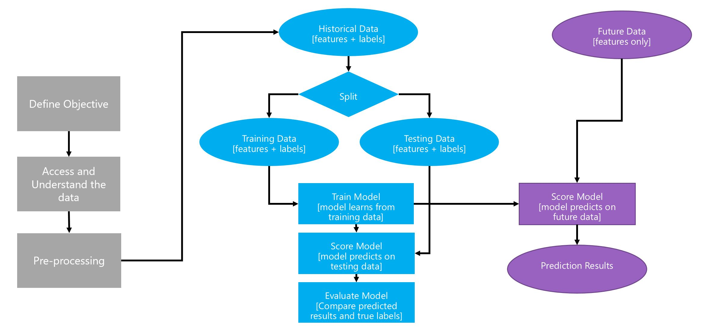
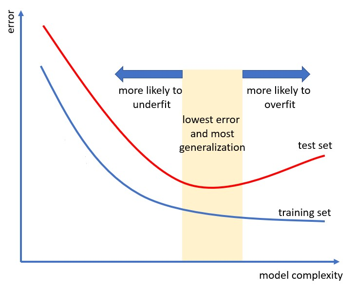
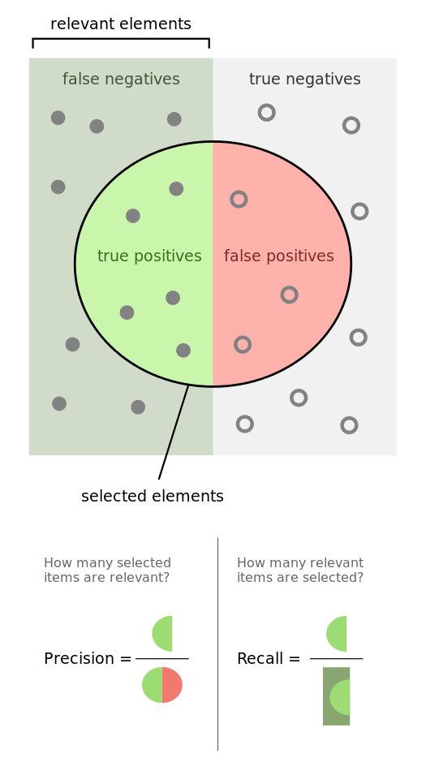

<!-- #4C2E84 -->
<!--  -->

<!-- _backgroundColor: #0473cf; -->
<!-- _color: white -->

# ___________________
# DataSci 420
# lesson 2: pitfalls of ML
## Seth Mottaghinejad
# ___________________

[DataSci 420]: https://www.pce.uw.edu/certificates/data-science
[break time]: https://www.google.com/search?q=online+timer
[lab time]: https://www.google.com/search?q=online+timer

----------------------------------------------------------------

## today's agenda

- historical data vs future data
- why and how we split data into trainig, testing, and validation
- parameters and hyper-parameters
- overfitting and how to avoid it
- what is cross-validation and how to do it
- what is class imbalance and how it affects model evaluation
- common metrics to consider when we have class imbalance

----------------------------------------------------------------

<!-- _class: lead -->
## important!

the remaining lectures starting now will only be concerned with **supervised learning**

----------------------------------------------------------------

## historical data vs future data

- data we use for modeling is a snapshot, e.g. the last two years
  - we refer to this as **historical data**, and it is labeled
- but we keep collecting data after we train the model
  - we refer to that as **future data**, and it may or may not be labled
- use historical data to create a model
- deploy the model to get predictions on future data, called **scoring**
- but if future data is unlabeled, how do we know if predictions are any good?

----------------------------------------------------------------

## a good model should generalize well

- I repeat: if future data is unlabeled, how do we know if predictions are any good?
- the premise of the question is this: **a model's performance should be measured on data that it hasn't seen during training**
- we say a good model should **generalize** or **extrapolate** to out-of-sample data (data not used for training)
- at training time we try to find parameters that minimize error **on the training data**, but there's no guarantee that this will also minimize error on out-of-sample data

----------------------------------------------------------------

## training and test data

- set aside a small **random** portion of historical data and **pretend it's future data**, we call this **test data**
- the remaining portion is called **training data**
- unlike future data, test data is **labeled**, so we can compare predictions with observed, also called **ground truth**
- so we use the training data to train a model
- then we **evaluate** the trained model's performance on the test data (data that the model didn't see at training time)

----------------------------------------------------------------

<!-- _backgroundColor: white; -->

----------------------------------------------------------------

<!-- _class: lead -->
## [break time]

----------------------------------------------------------------

## [lab time]

- imagine you need to learn a subject and there's no textbook for it
- all you have is a practice test with the answers included
  - a good analogy is driver's ed test
- you want to study for the upcoming exam and get a good grade
- if you've really studied, you should be able to correctly answer questions you haven't seen before
- how would you could **estimate** your grade in the upcoming exam, so you know if you need to study more or not?

----------------------------------------------------------------

## underfitting vs. overfitting

- *fitting* means learning: when we call the `.fit()` method
- if a model performs poorly on the training data, then it almost certainly will perform poorly on the test data as well: we say the model is **underfitting** (not learning enough)
- if a model performs well on the training data, but poorly on the test data: we say the model is **overfitting** (it's learning the signal but also "learning" the noise in the training data, and hence fails to generalize)
- a good model is one that neither underfits nor overfits

----------------------------------------------------------------

## overfitting and complexity

- more simple models tend to underfit, because they are more likely to oversimplify (not pick up enough signal)
  - analogy: models can be prejudiced too, we call it **bias**
- more complex models tend to overfit, because they are so eager to pick up any signal that they also grab noise disguised as signal
  - analogy: people who **read too much into** a literary passage
- the trick is to find the happy median
> *Everything should be made as simple as possible, but not simpler.* **Albert Einstein** (also look up **okam's razor**)

----------------------------------------------------------------

<!-- _backgroundColor: white; -->

----------------------------------------------------------------

<!-- _class: lead -->
## [break time]

----------------------------------------------------------------

## what are hyper-parameters?

- choosing a model isn't just about choosing the right ML algorithm
- almost all algorithm have ways they can be "tuned" through different **hyper-parameter** choices
- some hyper-parameters are very generic, such as the **learning rate**
- most hyper-parameters are algorithm-specific, such as
  - for tree-based algorithms: tree depth, min leaf size
- ML algorithms **cannot** directly learn optimal hyper-parameter values during training
- if we don't specify them, they usuall default to "reasonable" values

----------------------------------------------------------------

## model selection and validation

- so how do we know what hyper-parameter values to pick?
  - mostly through trial and error, though we call it **model selection**
- if we want to tune our hyper-parameters, we also need a **validation data** in addition to training and testing

1. train many models, each with a different set of hyper-parameters, and evaluate their performance on the validation data
1. the model that performs best on the validation data is the winner
1. check how the winner model performs on the test data

----------------------------------------------------------------

## [lab time]

the answer to this question is not at all straight-forward, but it's good to take some time to think about this:

- why don't we just use the test data as the validation data? 

in other words

1. train many models, each with a different set of hyper-parameters, and evaluate their performance on the test data
1. select the model which performs best on the test

----------------------------------------------------------------

## test data vs validation data

- so why not combine test data and validation data?
  - because the test data is used **once** with the **final model** to get an **unbiased estimate** of preformance (prediction error)
  - the validation data is used **many times** so we can compare the performance of models trained with different sets of hyper-parameters, a.k.a. **hyper-parameter tuning**
  - if we also use the test data to tune hyper-parameters, we are over-using it and its estimate of performance will not be so unbiased anymore

----------------------------------------------------------------

## recap

- we use a **training set** to estimates model's **parameters**
- we use a **validation set** when we (optionally) want to tune the model's **hyper-parameters** by training and evaluating **many times**
- the **test set** is used **once** to evaluate the model's performance so we can have an unbiased estimate of its prediction error, where **unbiased** here means
  - test data didn't infulence model's parameters (during training)
  - test data didn't influence model's hyper-parameters (during validation)

----------------------------------------------------------------

<!-- _class: lead -->
## [break time]

----------------------------------------------------------------

## [lab time]

consider how knowing the following information about your data should inflence how you split the data in trainig and test sets:
1. let's say you have class imbalance in your data, meaning some classes very sparse
1. most data is **cross-sectional**, meaning it's a single snapshot (or close) and every example (row) is **independent** of the rest, but data can also be **time-series**, meaning that the order matters because the past can influence the future, so our examples are **dependent** and the order is represented by a **time-stamp**

----------------------------------------------------------------

## more on class imbalance

- also sometimes referred to as **rate events** scenaro
- class imbalance is very common in many use-cases:
  - fraud detection (binary classification)
  - medical diagnosis (binary classification)

- class imbalance usually implies that not all errors (misclassification) should have the same importance
  - looking at accuracy (percent misclassifications) can be optimistic
  - instead we look at [other metrics], like precision, recall, or AUC

[other metrics]: http://www.win-vector.com/blog/2009/11/i-dont-think-that-means-what-you-think-it-means-statistics-to-english-translation-part-1-accuracy-measures/ 

----------------------------------------------------------------

## the confusion matrix

- it's really not that confusing!

|                   | predicted positive   | predicted negative  |
|-------------------|----------------------|---------------------|
| **actually positve**  | true positive `TP`   | false negative `FN` |
| **actually negative** | false positive `FP`  | true negative `TN`  |

- for `TP`/`FP`/`TN`/`FN`
  - the second letter indicates what the prediction was, and 
  - the first letter indicates if the prediction was right or not

----------------------------------------------------------------

## [lab time]

- we saw there a binary classification model can make two kinds of errors: `FP` and `FN`
- for the following scenarios, say what kind of error is more costly (use common sense)
  - **credit card fraud detection**: someone impersonates you to use your credit card
  - **medical diagnosis**: finding out who has a disease
  - **information retrieval**: finding relevant web pages based on a search query

----------------------------------------------------------------

## precision and recall

- **accuracy** is just the misclassification rate
- **precision** is the percentage of positive predictions that were actually positive
- **recall** is the percentage of positive cases that we correctly predicted as such
- image source: [wikipedia]

[wikipedia]: https://en.wikipedia.org/wiki/Precision_and_recall

----------------------------------------------------------------

## accuracy, precision and recall

- accuracy $=\dfrac{TP + TN}{TP + FP + TN + FN}$
- precision $=\dfrac{TP}{TP + FP}$
- recall $=\dfrac{TP}{TP + FN}$

- for rare events usually `TN` far exceeds `TP`, `FN`, or `FP`, **inflating accuracy**, but precision and recall don't have `TN` in it

----------------------------------------------------------------

## [lab time]

here's an analogy that to why we should evaluate a classification model's accuracy using **both** precision and recall:

- when you stand witness in a court of law, you are asked to tell the truth: 
  - **the whole truth**: no lie of omission
  - **nothing but the truth**: no lies
- relate the above two statements to precision and recall

----------------------------------------------------------------

<!-- _class: lead -->
## the end

<!-- what do we do when we find out we're overfitting?
- get more data (including synthetic data)
    - in deep learning: there is a term called "data augmentation"
- choose a more simple "model" (reduce number of parameters)
- decrease the number of features, or create more relevant features
- regularization: penalize models with high parameters
  - lasso regression has extra advantage: it can also be used for feature selection because some parameters converge to zero

- how much of data to split by? 80-10-10? 96-2-2?

- what is cross validation?
- used with small data sets
- instead of having a fix validation data, we can do this: 
- for every set of hyper-parameters values we want to try:
    - let's take the original training data and divide into k "folds"
    - we train the data on k-1 folds and validate it on the k-th fold (and we do this k times)
    - we average out the validated performance (across the k different runs)
after doing all this, we pick the set of hyper-parameters that has the best "cross-validated" performance

replace CV in notebook with pipline example -->
